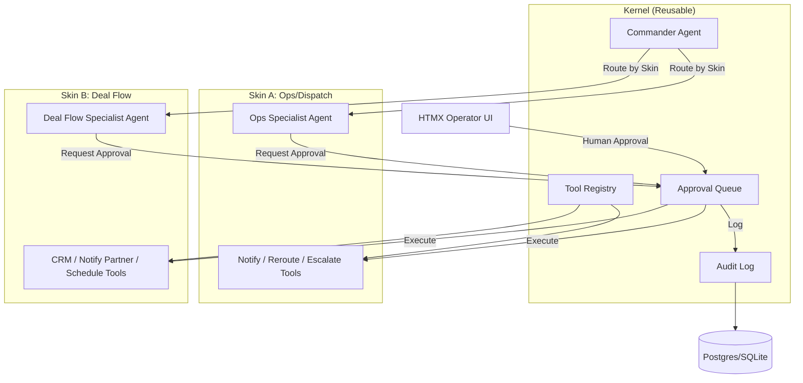

# Asyncraft Agent Kernel
**Production-shaped agent runtime with human-in-the-loop approval flow**

A reusable agent architecture demonstrating typed tool orchestration, HITL gates, and audit logging across multiple vertical use cases. Built for portfolio demonstration and job applications.

---

## Quick Start

```bash
# Clone and install
pip install -e ".[dev]"

# Copy env template
cp .env.example .env

# Run demo (SQLite, no external deps)
make demo

# Visit http://localhost:8000
# Click "Run Ops/Dispatch Demo" or "Run Deal Flow Demo"
# Approve/reject actions in the UI
```

**With Docker Compose (Postgres):**

```bash
docker-compose up
# Visit http://localhost:8000
```

---

## Architecture



### Core Components

**Kernel** (`asynccraft/kernel/`)
- **Agent Orchestration**: Commander routes to specialist agents via LangGraph
- **Tool Registry**: Typed tool definitions with `execute()` and `preview()` methods
- **HITL Approval Queue**: Enforces `preview → approve → execute` flow
- **Audit Log**: Persists runs, messages, approvals, tool executions with timestamps and approver identity

**Skins** (`asynccraft/skins/`)
- **Ops/Dispatch** (`ops_dispatch/`): Logistics exception handling (delays, breakdowns, escalations)
- **Deal Flow** (`deal_flow/`): VC pitch triage, scoring, and partner routing

**UI** (`asynccraft/ui/`)
- HTMX-based operator console for approval queue
- No client-side JavaScript framework required
- Real-time approval cards with tool preview and argument inspection

**Eval Harness** (`asynccraft/evals/`)
- Fixture-based regression tests
- CLI: `python -m asynccraft.evals run`
- Validates correct tool selection and argument passing

---

## Skins → Job Application Mapping

This repository demonstrates architecture patterns applicable to various contract and full-time opportunities:

| Skin                | Relevant Opportunities                                                                 | Key Resonance Points                                              |
|---------------------|----------------------------------------------------------------------------------------|-------------------------------------------------------------------|
| **Ops/Dispatch**    | Tight Line LangGraph, Fleetline/Freight Hero, MIR multi-agent ops, logistics outreach | Exception routing, tool preview, approval gates, audit            |
| **Deal Flow**       | A.Team marketplace, Alpaca deal-flow, Clera CRM automation                             | Scoring heuristics, partner routing, CRM writeback stubs          |
| **Kernel (both)**   | All of the above                                                                       | LangGraph orchestration, typed tools, HITL enforcement, eval harness |

**Sister proofs** (referenced, not in this repo):
- **Dispatch** ([dispatch.asynccraft.com](https://dispatch.asynccraft.com)): Jewelry manufacturing ops (MIR)
- **Radar** ([radar.asynccraft.com](https://radar.asynccraft.com)): Cold outreach pipeline for logistics

---

## Stack

- **Language**: Python 3.11+
- **Framework**: FastAPI + Uvicorn
- **Agent Orchestration**: LangGraph (LangChain)
- **Database**: SQLAlchemy 2.0 (async), Alembic migrations, Postgres or SQLite
- **UI**: Jinja2 templates + HTMX (no React/Vue overhead)
- **Testing**: pytest + pytest-asyncio
- **Deployment**: Docker Compose (Postgres), or local SQLite

---

## Project Structure

```
asynccraft-agent-kernel/
├── asynccraft/
│   ├── kernel/           # Core runtime (tool registry, HITL, agents)
│   ├── skins/
│   │   ├── ops_dispatch/ # Skin A: logistics exceptions
│   │   └── deal_flow/    # Skin B: VC pitch triage
│   ├── ui/               # HTMX operator interface
│   ├── evals/            # Evaluation harness
│   ├── main.py           # FastAPI app
│   └── api.py            # REST API routes
├── tests/                # pytest suite (HITL enforcement tests)
├── alembic/              # Database migrations
├── Dockerfile
├── docker-compose.yml
├── Makefile
├── pyproject.toml
└── README.md
```

---

## API Endpoints

**Runs**
- `POST /api/runs` — Create agent run
- `GET /api/runs` — List runs
- `GET /api/runs/{run_id}` — Get run details

**Approvals**
- `GET /api/approvals` — List approvals (filter by status)
- `POST /api/approvals/{approval_id}/approve` — Approve action
- `POST /api/approvals/{approval_id}/reject` — Reject action

**Metadata**
- `GET /api/tools` — List registered tools
- `GET /api/config` — Get active skin and config
- `GET /health` — Health check

**Interactive Docs**: Visit `/docs` (Swagger UI) or `/redoc`

---

## HITL Enforcement

**Design principle**: No side-effect tool executes without human approval.

1. **Agent proposes action** → Creates approval request with tool preview
2. **Operator reviews** → Sees plain-English description + tool args in UI
3. **Operator approves/rejects** → Decision logged with approver name and timestamp
4. **Tool executes** (only if approved) → Result stored and linked to approval

**Audit trail**: Every approval records:
- Tool name and arguments
- Preview description
- Approver identity
- Decision timestamp
- Execution result (if approved)

**Tested in**: `tests/kernel/test_approval.py`

---

## Eval Harness

Fixture-based regression suite validates agent behavior:

```bash
python -m asynccraft.evals run
```

**Checks**:
- Correct tool selection for input scenarios
- Argument passing accuracy
- Multi-skin coverage (ops + deal flow)

**Exit codes**: 0 = all pass, 1 = failures

---

## Development

```bash
# Install with dev dependencies
pip install -e ".[dev]"

# Run tests
make test

# Format code
make format

# Lint
make lint

# Database migrations
make db-upgrade
make db-downgrade
```

---

## Configuration

Environment variables (`.env`):

```bash
DATABASE_URL=sqlite:///./asynccraft.db  # or postgresql://...
OPENAI_API_KEY=sk-mock-key-for-demo    # Optional, uses mock by default
ACTIVE_SKIN=ops_dispatch               # or deal_flow
DEBUG=true
API_HOST=0.0.0.0
API_PORT=8000
```

---

## Extending

**Add a new skin:**

1. Create `asynccraft/skins/your_skin/`
2. Define tools in `tools.py` (inherit from `Tool`, implement `execute()` and `preview()`)
3. Create specialist agent in `agent.py` (inherit from `BaseAgent`)
4. Register tools in `main.py` lifespan
5. Add eval cases in `asynccraft/evals/runner.py`

**Add a new tool:**

```python
from asynccraft.kernel.tools import Tool, ToolResult

class YourTool(Tool):
    @property
    def name(self) -> str:
        return "your_tool"
    
    @property
    def description(self) -> str:
        return "What this tool does"
    
    async def execute(self, **kwargs) -> ToolResult:
        # Implementation
        return ToolResult(success=True, data={"result": "..."})
    
    def preview(self, **kwargs) -> str:
        return "Human-readable action description"
```

---

## Deployment

**Local (SQLite):**
```bash
make demo
```

**Docker Compose (Postgres):**
```bash
docker-compose up
```

**Production considerations** (documented, not implemented):
- Deploy API to Fly.io or Render
- Use managed Postgres (Supabase, Neon, AWS RDS)
- Add authentication (JWT or session-based)
- Set up monitoring (Sentry, Datadog)
- Enable HTTPS

---

## Testing

```bash
pytest tests/ -v
```

**Test coverage:**
- HITL approval workflow (request, approve, reject, audit)
- Cannot execute without approval
- Cannot approve twice
- Audit trail preservation

---

## License

MIT License - see LICENSE file

---

## Author

**Varinder Nagra** ([asynccraft.com](https://asynccraft.com))

Portfolio demonstration repository for agent engineering roles (Tight Line, A.Team, Alpaca, Clera, MIR, logistics).

---

## Application Blurb (3 sentences)

> Built a production-shaped agent runtime with typed tool orchestration, human-in-the-loop approval gates, and audit logging across two vertical demos (logistics ops, VC deal flow). The kernel enforces preview → approve → execute for all side effects, with full audit trails and an eval harness. LangGraph + FastAPI + SQLAlchemy; runnable locally with `make demo` and extensible for multi-agent workflows.

---

## Sister Projects

- **Dispatch** (dispatch.asynccraft.com): MIR jewelry manufacturing ops agent
- **Radar** (radar.asynccraft.com): Logistics cold outreach pipeline
- **Agent Kernel** (this repo): Reusable runtime for both + future verticals

---

## FAQ

**Q: Why HTMX instead of React/Next?**  
A: Simpler for operator UIs with server-side rendering. No build step, no client state management. Can swap for React if needed.

**Q: Why SQLite by default?**  
A: Zero-config local demo. Use Postgres in docker-compose or production.

**Q: Can I use this in production?**  
A: This is a portfolio demo. For production: add auth, monitoring, rate limiting, error handling, and test coverage beyond the core approval flow.

**Q: How do I add a real LLM?**  
A: Set `OPENAI_API_KEY` in `.env`. Agents currently use rule-based routing; integrate `langchain_openai.ChatOpenAI` in agent `invoke()` methods for LLM decision-making.

**Q: What about the RailCall airlock module mentioned?**  
A: Not implemented (time constraint). Conceptual: Ed25519-signed receipts for approve → execute → verify flow. Add as `packages/airlock/` if needed.

---

## Acknowledgments

Built for demonstration of agent architecture patterns suitable for contract and full-time opportunities in logistics, VC automation, and multi-agent operations.
